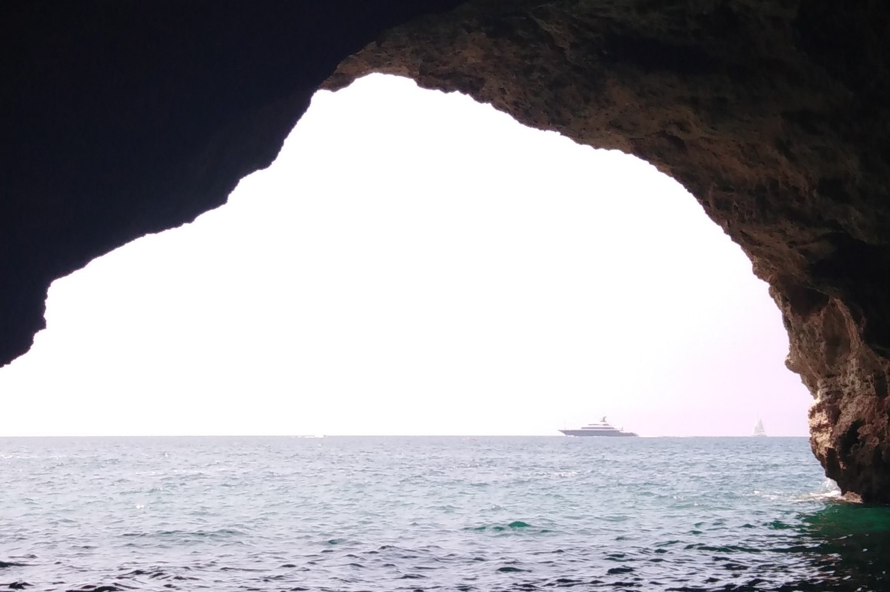

## Welcome to my blog!

I hope to publish past research along with other interesting tutorials using R and Python. My areas of interest for research include Econometrics, Actuarial Science, and Machine Learning. As for the picture above, I want to clarify that I am by no means an expert, especially when it comes to using Python. This blog and data science in general, is still a journey into the unknown for me. Hope you can come along and discover the beauty behind it!

